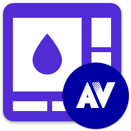

<div id="top"></div>

<!-- PROJECT INFO -->
<br />
<div align="center">
  
  
  
  
  
  
  
  
  
  
</div>

<h1 align="center">My .NET</h1>

[![MIT License][license-shield]][license-url]
[](https://github.com/sandre58/mynet/stargazers)
[](https://github.com/sandre58/mynet/network/members)
[](https://github.com/sandre58/mynet/issues)
[](https://github.com/sandre58/mynet/commits/main)
[](https://github.com/sandre58/mynet/graphs/contributors)
[](https://github.com/sandre58/mynet)

A comprehensive collection of powerful libraries and extensions for modern .NET development (8.0, 9.0, and 10.0). Each package is carefully designed to be independent, modular, and production-ready, enabling developers to pick exactly what they need to enhance their applications.

## Packages

[![Build][build-shield]][build-url]
[](https://codecov.io/gh/sandre58/mynet)
[](#)
[](#)
[](#)
[](#)

| Package | Description | NuGet |
|---|---|---|
| [**MyNet.Utilities**](src/MyNet.Utilities) | 🔧 Core utilities for .NET development: authentication, cache, encryption, geography, generator, Google services, IO operations, localization, logging, mail, messaging, progress tracking, and threading utilities. | [](https://www.nuget.org/packages/MyNet.Utilities) |
| [**MyNet.UI**](src/MyNet.UI) | 🎨 UI helpers for notifications, dialogs, navigation, themes, and user interface components. | [](https://www.nuget.org/packages/MyNet.UI) |
| [**MyNet.Observable**](src/MyNet.Observable) | 🔄 Editable and validatable object base classes with property change notifications and validation support. | [](https://www.nuget.org/packages/MyNet.Observable) |
| [**MyNet.Humanizer**](src/MyNet.Humanizer) | 👤 Convert objects and values to human-readable strings with natural language formatting. | [](https://www.nuget.org/packages/MyNet.Humanizer) |
| [**MyNet.CsvHelper.Extensions**](src/MyNet.CsvHelper.Extensions) | 📊 Extensions for CsvHelper to simplify CSV mapping, import, and export operations. | [](https://www.nuget.org/packages/MyNet.CsvHelper.Extensions) |
| [**MyNet.AutoMapper.Extensions**](src/MyNet.AutoMapper.Extensions) | 🗺️ Extensions and helpers for seamless AutoMapper integration and configuration. | [](https://www.nuget.org/packages/MyNet.AutoMapper.Extensions) |
| [**MyNet.Http**](src/MyNet.Http) | 🌐 HTTP client helpers and extensions for simplified web API communication. | [](https://www.nuget.org/packages/MyNet.Http) |
| [**MyNet.Utilities.Generator.Extensions**](src/MyNet.Utilities.Generator.Extensions) | 🎲 Generate realistic random data for testing, demos, and simulations. | [](https://www.nuget.org/packages/MyNet.Utilities.Generator.Extensions) |
| [**MyNet.Utilities.Geography.Extensions**](src/MyNet.Utilities.Geography.Extensions) | 🌍 Access detailed geography information including countries, cities, and regions. | [](https://www.nuget.org/packages/MyNet.Utilities.Geography.Extensions) |
| [**MyNet.Utilities.Localization.Extensions**](src/MyNet.Utilities.Localization.Extensions) | 🌐 Localization resources and helpers for multi-language applications. | [](https://www.nuget.org/packages/MyNet.Utilities.Localization.Extensions) |
| [**MyNet.Utilities.Logging.NLog**](src/MyNet.Utilities.Logging.NLog) | 📝 Logging integration with NLog for structured logging. | [](https://www.nuget.org/packages/MyNet.Utilities.Logging.NLog) |
| [**MyNet.Utilities.Mail.MailKit**](src/MyNet.Utilities.Mail.MailKit) | 📧 Email sending capabilities with MailKit integration. | [](https://www.nuget.org/packages/MyNet.Utilities.Mail.MailKit) |
| [**MyNet.Avalonia**](src/Avalonia/MyNet.Avalonia) | 🖥️ Avalonia UI helpers and extensions for cross-platform desktop applications. | [](https://www.nuget.org/packages/MyNet.Avalonia) |
| [**MyNet.Avalonia.Controls**](src/Avalonia/MyNet.Avalonia.Controls) | 🎛️ Custom Avalonia controls and components. | [](https://www.nuget.org/packages/MyNet.Avalonia.Controls) |
| [**MyNet.Avalonia.Theme**](src/Avalonia/MyNet.Avalonia.Theme) | 🎨 Avalonia theming resources and styles. | [](https://www.nuget.org/packages/MyNet.Avalonia.Theme) |
| [**MyNet.Avalonia.UI**](src/Avalonia/MyNet.Avalonia.UI) | 🖼️ UI extensions and utilities for Avalonia applications. | [](https://www.nuget.org/packages/MyNet.Avalonia.UI) |
| [**MyNet.Xaml.Html**](src/Wpf/MyNet.Xaml.Html) | 🔄 XAML to HTML conversion and helpers. | [](https://www.nuget.org/packages/MyNet.Xaml.Html) |
| [**MyNet.Wpf**](src/Wpf/MyNet.Wpf) | 🪟 WPF helpers and extensions for Windows desktop applications. | [](https://www.nuget.org/packages/MyNet.Wpf) |
| [**MyNet.Wpf.DragAndDrop**](src/Wpf/MyNet.Wpf.DragAndDrop) | 🖱️ WPF drag and drop helpers and utilities. | [](https://www.nuget.org/packages/MyNet.Wpf.DragAndDrop) |
| [**MyNet.Wpf.LiveCharts**](src/Wpf/MyNet.Wpf.LiveCharts) | 📈 WPF LiveCharts integration for data visualization. | [](https://www.nuget.org/packages/MyNet.Wpf.LiveCharts) |
| [**MyNet.Wpf.Presentation**](src/Wpf/MyNet.Wpf.Presentation) | 📽️ WPF presentation helpers and MVVM utilities. | [](https://www.nuget.org/packages/MyNet.Wpf.Presentation) |
| [**MyNet.Wpf.Web**](src/Wpf/MyNet.Wpf.Web) | 🌐 WPF web integration and browser components. | [](https://www.nuget.org/packages/MyNet.Wpf.Web) |

## 🚀 Getting Started

### Prerequisites

- **.NET 8.0, 9.0, or 10.0** - The libraries support the latest .NET versions
- **Visual Studio 2022** or **Visual Studio Code** (recommended)
- **NuGet** package manager

### Installation

Install any package via NuGet Package Manager, .NET CLI, or PackageReference:

**Using .NET CLI:**
```bash
# Core utilities package
dotnet add package MyNet.Utilities

# UI helpers package  
dotnet add package MyNet.UI

# Observable objects package
dotnet add package MyNet.Observable

# Humanization package
dotnet add package MyNet.Humanizer

# CSV operations package
dotnet add package MyNet.CsvHelper.Extensions

# Avalonia UI package
dotnet add package MyNet.Avalonia

# WPF extensions package
dotnet add package MyNet.Wpf
```

**Using Package Manager Console:**
```powershell
Install-Package MyNet.Utilities
Install-Package MyNet.UI
# ... and so on
```

**Using PackageReference:**
```xml
<PackageReference Include="MyNet.Utilities" Version="1.0.*" />
<PackageReference Include="MyNet.UI" Version="1.0.*" />
```

### Quick Start

After installing a package, explore the package-specific documentation in the `src/` directory of each project for detailed usage examples and API references.

## 📁 Repository Structure

- **`src/`** — Source code for all packages organized by category:
  - **`MyNet.Utilities*`** — Core utilities and extensions
  - **`MyNet.UI`** — Cross-platform UI helpers
  - **`MyNet.Observable`** — Observable object patterns and validation
  - **`MyNet.Humanizer`** — Human-readable string conversion
  - **`MyNet.CsvHelper.Extensions`** — CSV import/export utilities
  - **`MyNet.AutoMapper.Extensions`** — Object mapping helpers
  - **`MyNet.Http`** — HTTP client utilities
  - **`Avalonia/`** — Cross-platform UI packages for Avalonia
  - **`Wpf/`** — Windows-specific WPF packages

- **`demos/`** — Example applications showcasing library features
  - **`MyNet.Avalonia.Demo/`** — Cross-platform Avalonia demo
  - **`MyNet.Wpf.Demo/`** — Windows WPF demo
  
- **`tests/`** — Comprehensive unit and integration tests
- **`assets/`** — Project logos, icons, and visual assets
- **`build/`** — MSBuild configuration and shared properties
- **`scripts/`** — Build automation and utility scripts
- **`.github/`** — CI/CD workflows and GitHub automation

## 🛠️ Development

### Building from Source

```bash
# Clone the repository
git clone https://github.com/sandre58/MyNet.git
cd MyNet

# Build all projects
dotnet build

# Run tests
dotnet test

# Create packages
dotnet pack
```

### Contributing

We welcome contributions! Please see our [Contributing Guidelines](CONTRIBUTING.md) and [Code of Conduct](CODE_OF_CONDUCT.md) for details on how to get involved.

## 📄 License

Copyright © 2016-2025 Stéphane ANDRE.

Distributed under the MIT License. See [LICENSE](./LICENSE) for complete details.

<!-- MARKDOWN LINKS & IMAGES -->
[license-shield]: https://img.shields.io/github/license/sandre58/MyNet?style=for-the-badge
[license-url]: https://github.com/sandre58/MyNet/blob/main/LICENSE
[build-shield]: https://img.shields.io/github/actions/workflow/status/sandre58/MyNet/ci.yml?logo=github&label=CI
[build-url]: https://github.com/sandre58/MyNet/actions