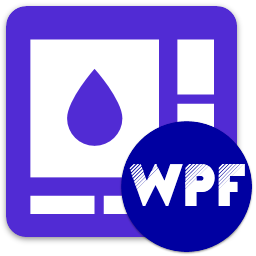

<div id="top"></div>

<!-- PROJECT INFO -->
<br />
<div align="center">
  
</div>

<h1 align="center">MyNet.Wpf Demo Application</h1>

[](https://github.com/sandre58/MyWpf/blob/main/LICENSE)

A comprehensive demonstration application showcasing all features and capabilities of the MyNet.Wpf library collection.

[](#)
[](#)
[](#)
[](#)

---

## 📋 Overview

MyNet.Wpf.Demo is a fully-featured WPF application that demonstrates:

- 🎨 **Advanced Theming** - Material Design integration with dynamic theme switching
- 🪟 **Custom Controls** - Rich set of specialized WPF controls
- 🖱️ **Drag & Drop** - Advanced drag-and-drop functionality with visual feedback
- 📊 **Data Visualization** - Interactive charts and graphs using LiveCharts
- 🏗️ **MVVM Architecture** - Complete implementation of MVVM pattern
- 🌐 **Web Integration** - Browser controls and web view components
- 🔔 **Notifications** - Toast notifications and dialog systems
- 📝 **Rich Editors** - Text editors with XAML/HTML conversion
- 🎯 **Navigation** - Multi-window and page navigation patterns
- ⚙️ **Configuration** - Settings management and persistence

## 🚀 Getting Started

### Prerequisites

- **Windows 10/11** - Required for WPF applications
- **.NET 8.0, 9.0, or 10.0 SDK** - [Download here](https://dotnet.microsoft.com/download)
- **Visual Studio 2022** - Recommended IDE for WPF development

### Running the Demo

#### Option 1: Using Visual Studio
1. Open `MyWpf.sln` in Visual Studio 2022
2. Set `MyNet.Wpf.Demo` as the startup project
3. Press `F5` or click "Start"

#### Option 2: Using .NET CLI
```bash
# Navigate to the demo directory
cd demos/MyNet.Wpf.Demo

# Run the application
dotnet run
```

#### Option 3: Download Pre-built Binary
Download the latest self-contained executable from the [GitHub Actions Artifacts](https://github.com/sandre58/MyWpf/actions) - no installation required!

## 🎯 Features Demonstrated

### 🎨 Theming & Styling
- **Light/Dark Themes** - Toggle between light and dark color schemes
- **Primary Color Picker** - Choose from multiple accent colors
- **Material Design** - Full Material Design theme implementation
- **Custom Styles** - Browse all available control styles

### 🪟 Controls Showcase
- **Buttons** - Standard, icon, toggle, split buttons
- **Input Controls** - TextBoxes, ComboBoxes, DatePickers, TimePickers
- **Data Controls** - DataGrids, ListViews, TreeViews
- **Navigation** - Tabs, NavigationView, Breadcrumbs
- **Feedback** - ProgressBars, Spinners, Badges
- **Dialogs** - Message boxes, confirmation dialogs, custom dialogs

### 📊 Data Visualization
- **Line Charts** - Animated line charts with multiple series
- **Bar Charts** - Horizontal and vertical bar charts
- **Pie Charts** - Donut and pie chart visualizations
- **Gauges** - Circular and linear gauge controls
- **Live Updates** - Real-time data updating charts

### 🖱️ Drag & Drop
- **File Drop** - Drag files from Explorer into the application
- **List Reordering** - Drag items to reorder lists
- **Calendar Events** - Drag and drop calendar items
- **Custom Adorners** - Visual feedback during drag operations

### 🔔 Notifications & Dialogs
- **Toast Notifications** - Non-intrusive notifications with actions
- **Modal Dialogs** - Message boxes and confirmation dialogs
- **Progress Dialogs** - Long-running operation feedback
- **Custom Dialogs** - Create your own dialog windows

### 📝 Rich Text Editing
- **WYSIWYG Editor** - Rich text editor with formatting toolbar
- **XAML to HTML** - Convert XAML FlowDocument to HTML
- **Syntax Highlighting** - Code editor with syntax highlighting
- **Document Preview** - Live preview of formatted content

### 🌐 Web Integration
- **WebView Control** - Embedded browser in WPF
- **HTML Rendering** - Display HTML content in WPF
- **JavaScript Interaction** - Call JavaScript from C# and vice versa

### 🏗️ MVVM Pattern
- **ViewModel Examples** - Proper ViewModel implementation
- **Commands** - RelayCommand and AsyncCommand usage
- **Data Binding** - Two-way binding examples
- **Validation** - Input validation with INotifyDataErrorInfo
- **Collections** - ObservableCollection and filtering

## 📁 Project Structure

```
MyNet.Wpf.Demo/
├── App.xaml                    # Application entry point and global resources
├── AppConfiguration.cs         # Application configuration and DI setup
├── ViewModels/                 # MVVM ViewModels
│   ├── MainViewModel.cs        # Main window ViewModel
│   ├── ThemingViewModel.cs     # Theme management ViewModel
│   └── ...                     # Feature-specific ViewModels
├── Views/                      # XAML Views
│   ├── MainWindow.xaml         # Main application window
│   ├── ThemingView.xaml        # Theming demonstration view
│   └── ...                     # Feature-specific views
├── Services/                   # Application services
│   ├── DialogService.cs        # Dialog management
│   ├── NavigationService.cs    # Navigation management
│   └── ...                     # Other services
├── Resources/                  # Application resources
│   ├── Styles/                 # Custom styles
│   ├── Images/                 # Image assets
│   └── Translations/           # Localization files
├── Data/                       # Sample data
└── Parameters/                 # Configuration files
```

## 🔧 Configuration

The demo application can be configured through `appsettings.json`:

```json
{
  "Theme": {
    "IsDark": false,
    "PrimaryColor": "Blue"
  },
  "Language": "en-US",
  "StartupView": "Home"
}
```

## 📚 Learning Resources

This demo application serves as:

- **📖 Documentation** - See how to implement each feature
- **🎓 Tutorial** - Learn WPF best practices and patterns
- **🔍 Reference** - Browse working examples of all controls
- **🧪 Testbed** - Experiment with library features

## 🛠️ Building from Source

```bash
# Clone the repository
git clone https://github.com/sandre58/MyWpf.git
cd MyWpf

# Restore dependencies
dotnet restore

# Build the demo
dotnet build demos/MyNet.Wpf.Demo

# Run the demo
dotnet run --project demos/MyNet.Wpf.Demo
```

## 📦 Used Packages

This demo showcases the following MyNet.Wpf packages:

- **[MyNet.Wpf](../../src/MyNet.Wpf)** - Core WPF library
- **[MyNet.Wpf.DragAndDrop](../../src/MyNet.Wpf.DragAndDrop)** - Drag-and-drop functionality
- **[MyNet.Wpf.LiveCharts](../../src/MyNet.Wpf.LiveCharts)** - Chart visualization
- **[MyNet.Wpf.Presentation](../../src/MyNet.Wpf.Presentation)** - MVVM helpers
- **[MyNet.Wpf.Web](../../src/MyNet.Wpf.Web)** - Web integration
- **[MyNet.Xaml.Html](../../src/MyNet.Xaml.Html)** - XAML/HTML conversion

## 🤝 Contributing

Found a bug in the demo or have a suggestion? Please open an issue on [GitHub](https://github.com/sandre58/MyWpf/issues).

## 📄 License

Copyright © 2016-2025 Stéphane ANDRE.

This demo application is provided as-is under the MIT license. See [LICENSE](../../LICENSE) for details.